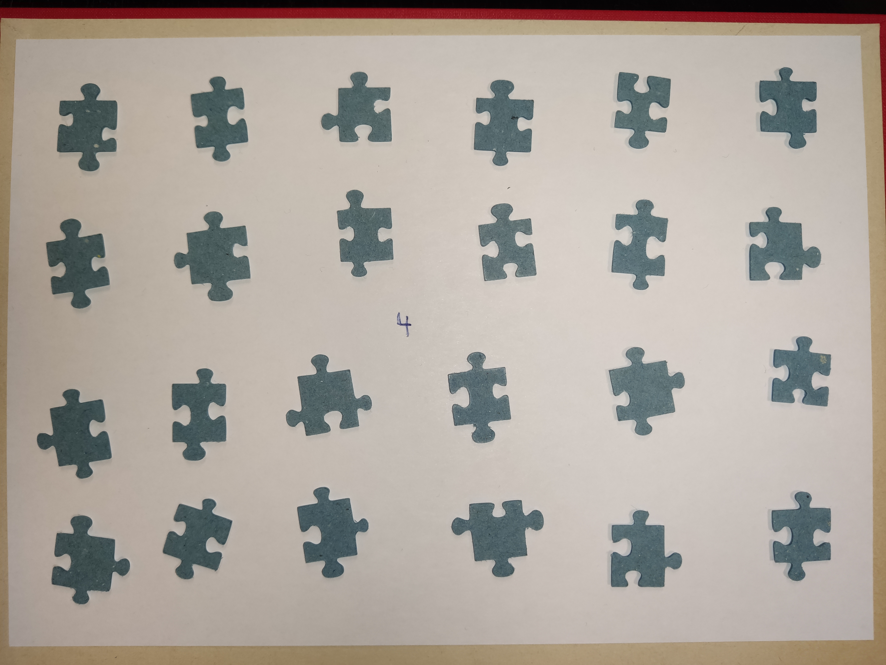
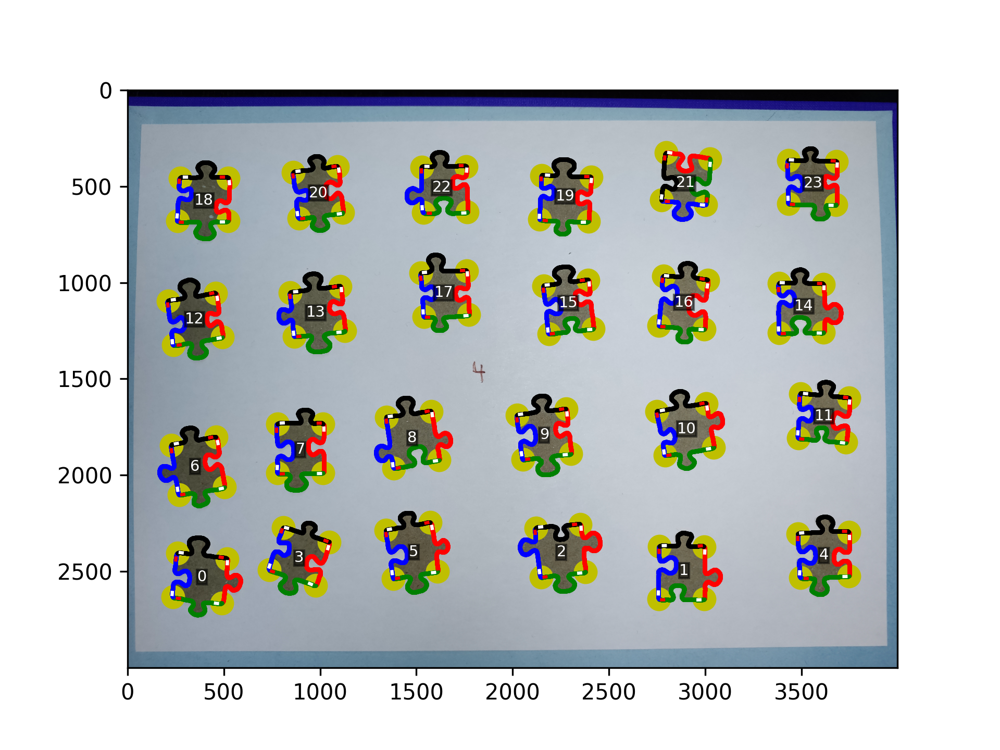
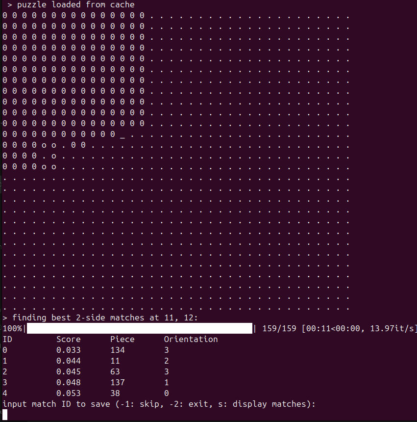
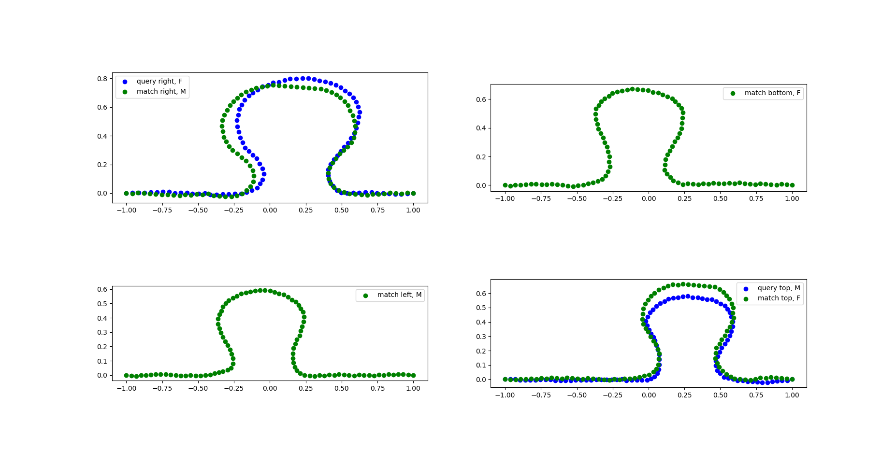

# Jigsaw Puzzle Solver

Get interactive assistance in solving any jigsaw puzzle by simply providing photos of your puzzle pieces. The application interactively suggests possible next matches by analysing the current pieces contours.

## Technical steps

Input: photo of multiple puzzle pieces on white background, back side of the puzzle pieces are showing.

Image processing:
- Extracts contour of all pieces
- Extracts 4 corners from countour
- Extracts the 4 sides as splines

The CLI allows you to interactively solve the puzzle piece by piece:
- Solved pieces are shown as '0' while missing pieces show as '.'
- Provides a list of best matches for a given location in the puzzle at '_'
- Matches are found by comparing polarity of sides (male/female) as well as comparing the shapes using l2 norm

Visually compare a possible match:

