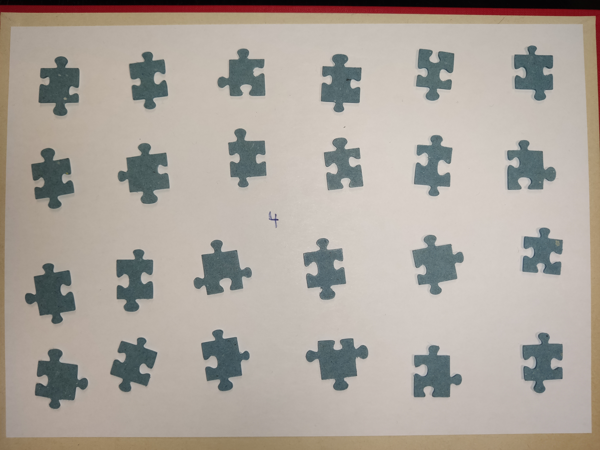
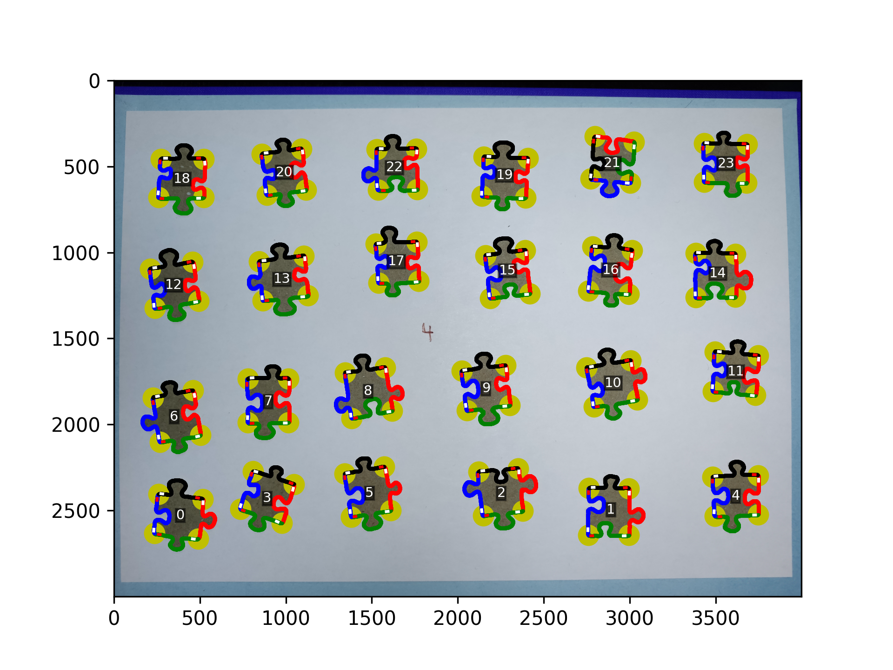
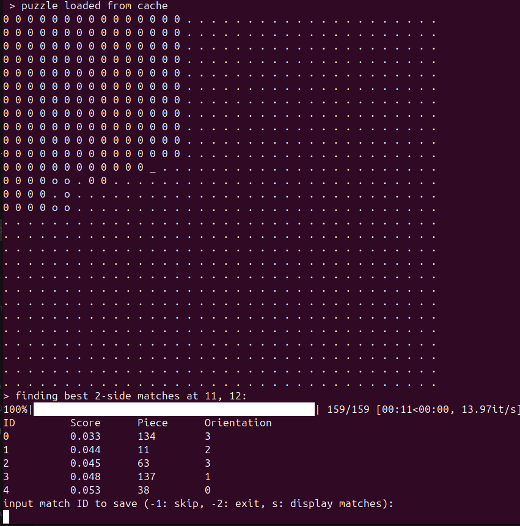
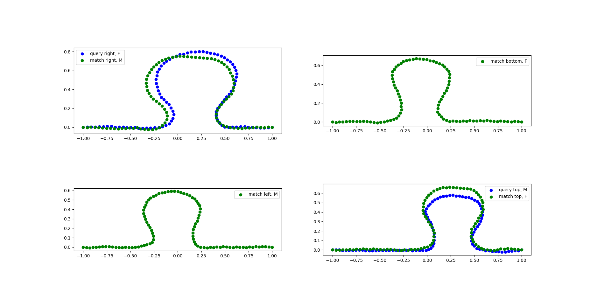
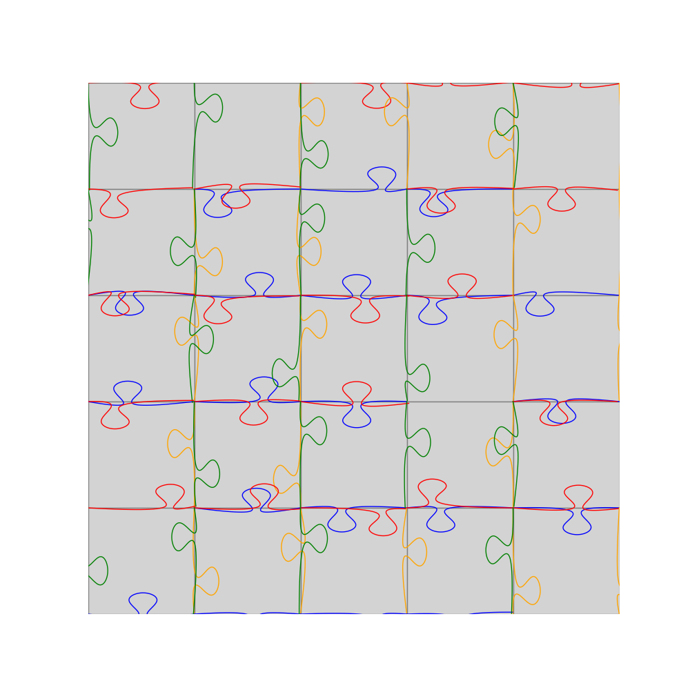
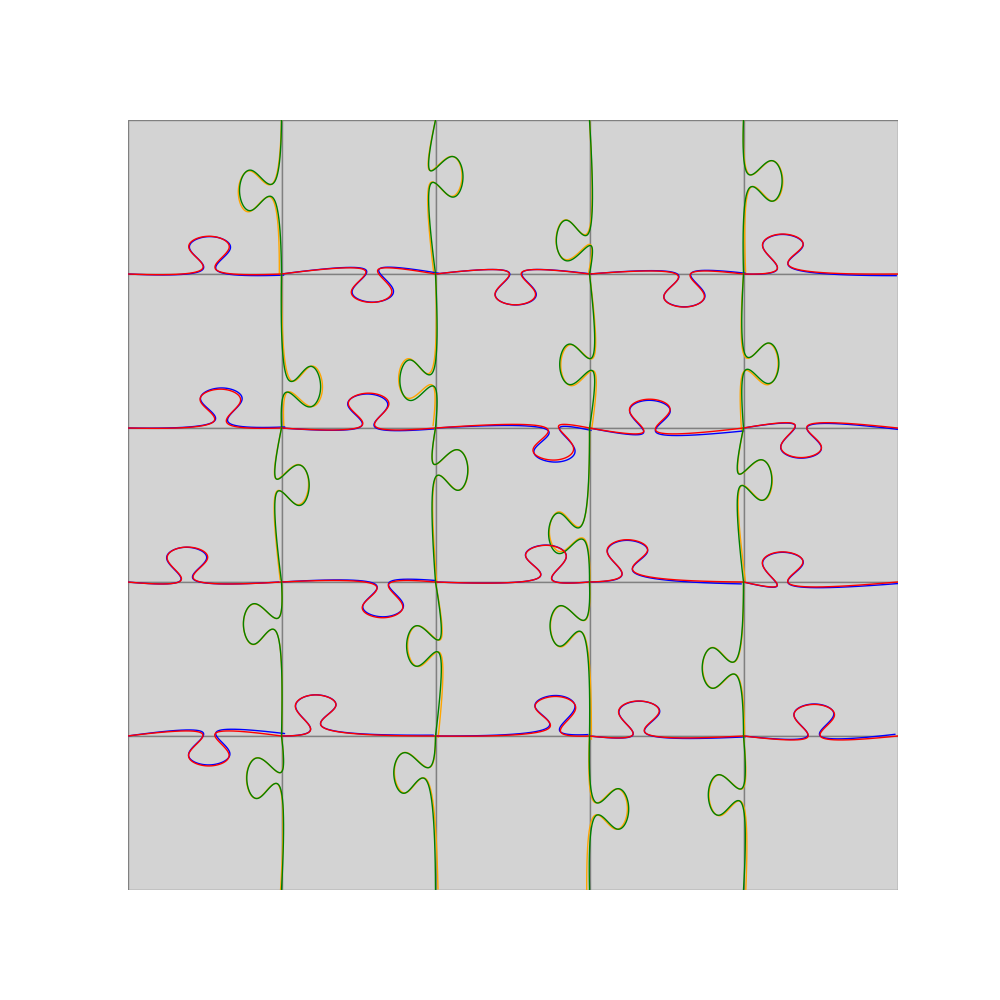

# Jigsaw Puzzle Solver

Get interactive assistance in solving any jigsaw puzzle by simply providing photos of your puzzle pieces. The application interactively suggests possible next matches by analysing the current pieces contours.

## Technical steps

Input: photo of multiple puzzle pieces on white background, back side of the puzzle pieces are showing.



Image processing:
- Extracts contour of all pieces
- Extracts 4 corners from countour
- Extracts the 4 sides as splines


The CLI allows you to interactively solve the puzzle piece by piece:
- Solved pieces are shown as '0' while missing pieces show as '.'
- Provides a list of best matches for a given location in the puzzle at '_'
- Matches are found by comparing polarity of sides (male/female) as well as comparing the shapes using l2 norm



Visually compare a possible match:



## Simulated Puzzles

To accelerate the development and testing of solving strategies, we introduce a simulated puzzle pipeline. This lets us evaluate algorithms and distance metrics (e.g. L2 norm between splines) **without requiring physical photos**, enabling faster iteration and prototyping.

---

### Puzzle Generation

A simulated puzzle is defined by a fixed grid size (e.g. 5×5), where each piece is procedurally generated. The generation process follows these steps:

- **Border pieces** receive flat sides.
- **Interior sides** are generated with random **spline shapes**, parameterized by features like:
  - Head/neck width and height
  - Horizontal center
  - Vertical offset (height)
- Matching sides are created by:
  - Copying one spline
  - Flipping polarity (male ↔ female)
  - Applying a **small random projective transformation** to introduce realistic imperfections (controlled by `delta_e`), such as:
    - Shearing
    - Perspective warp
    - Minor scaling differences

These splines are defined in normalized coordinates \([0, 1]^2\) and later scaled during visualization.

Once the full puzzle is constructed, the pieces are **shuffled** and optionally assigned **random rotations**.

Example of an initial 5×5 puzzle:



---

### Puzzle Solving

We use a **Branch and Bound (BnB)** approach with depth-first search (DFS) to explore possible piece placements. This ensures **constant memory usage** and can theoretically find a **globally optimal solution**.

Key details:
- Each state consists of a grid, orientations, remaining piece IDs, and accumulated error.
- The algorithm places pieces one by one using a **heuristic** that:
  - Constructs a placeholder piece from adjacent placed neighbors.
  - Computes side-to-side distance to each remaining candidate (over 4 orientations).
- Errors are calculated using **polarity mismatch checks** and **L2 distance** between spline samples.

To control complexity and runtime:
- `abortThreshold` defines the max total error for which we consider a solution "good enough" — when reached, search stops early.
- `randomErrorThreshold` prunes piece candidates with high matching errors. A good value can be estimated using:
  
  ```python
  puzzle.getRandomError(10000)
  # Suggestion: set threshold ≈ mean - std
  ```

If solving completes, the solution is validated **up to rotation invariance** — that is, any rotation of 0°, 90°, 180°, or 270° is accepted as correct.

Final solved puzzle — visually indistinguishable from ground truth, except for small spline mismatches caused by the applied perturbations:



---

## Spline Shape and Perturbation

The realism and uniqueness of each puzzle piece is driven by the shape of its **spline edges**, which simulate the interlocking geometry of jigsaw pieces. Each spline encodes a **1D shape** across a side, sampled as a set of (x, y) points.

---

### Spline Shape Model

Each spline is generated using a set of **seven control points** and passed through a smooth interpolator (B-spline). These control points are parameterized by:

- `center`: horizontal position of the bump (typically 0.2–0.8)
- `height`: vertical tip height of the bump
- `neck_width` / `head_width`: controls the width of neck and head features
- `neck_height` / `head_height`: controls the relative heights of those sections
- `height_offset`: vertical shift of the entire spline without end points

These define a profile like:


Control points are placed symmetrically and interpolated using cubic splines to produce smooth curves.

---

### Projective Perturbations

To simulate real-world imperfections (e.g. taking a photo at a slight angle), a random **projective transformation** is applied when a piece copies a neighbor's edge:

- **Shear** — simulates angled pull/stretch
- **Perspective** — introduces mild warp
- **Scale** — uniform scaling (usually fixed to 1.0)
- **Translation** — typically 0 (handled during placement)

These perturbations are **very small** (e.g. ±0.02) and controlled via a `delta_e` parameter. They ensure that even matching sides have **non-zero but minimal distance**, making the problem more realistic and robust to noise.